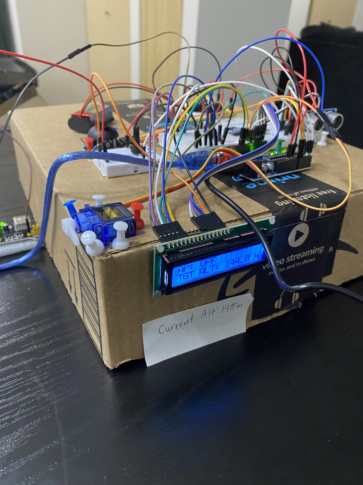
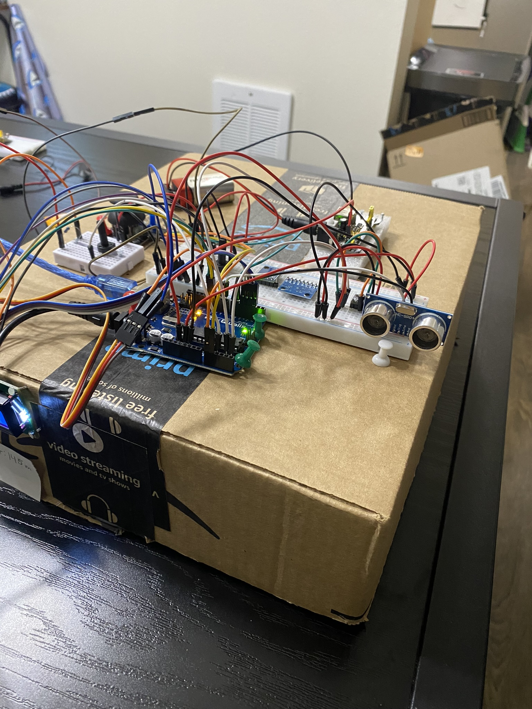
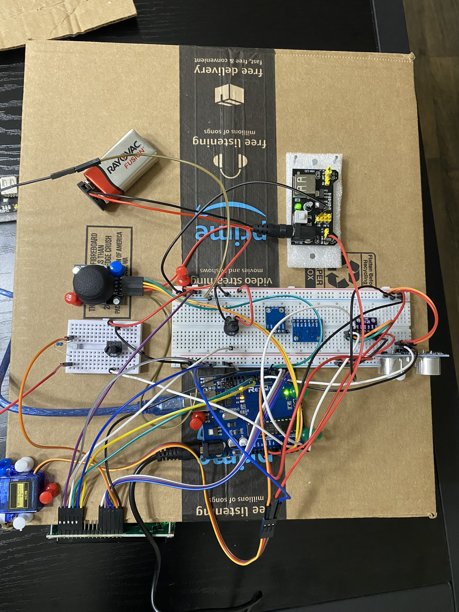

# Arduino Altitude Control System with Obstacle Avoidance

A DIY autopilot system designed with Arduino that features smooth altitude control, ultrasonic obstacle detection, and real-time monitoring. The system uses PID stabilization for smooth servo actuation, integrates an LCD display for visual feedback, and employs a joystick for manual control.

## Overview

This project began as a personal challenge to build a small-scale simulated flight control module using nothing more than a basic Arduino starter kit. The goal was to create a just-for-fun embedded system that demonstrates the integration of hardware and real-time software into a functional and interactive prototype.

The system combines various components, including sensors, an actuator, and a user interface, to mimic the behavior of an aircraft's pitch control. By implementing real-time processing, a PID controller, and noise filtering, the project showcases principles of embedded systems and control engineering. Additionally, the integration of ultrasonic obstacle avoidance, an LCD for feedback, and a joystick for manual control adds layers of complexity and interaction.

This project not only allowed me to explore embedded systems and real-time programming concepts but also provided hands-on experience in combining hardware and software to solve practical challenges.

## Wiring Diagram

## Components Used

| Component              | Connections |
|------------------------|-------------|
| **Arduino Uno R3**     | -           |
| **Servo Motor**        | Signal to D9, VCC to 5V, GND to GND |
| **Ultrasonic Sensor**  | Trig to D8, Echo to D6, VCC to 5V, GND to GND |
| **LCD Display (16x2)** | RS to D12, E to D11, D4-D7 to D5-D2, VCC to 5V, GND to GND |
| **BMP280 Sensor**      | SDA to A4, SCL to A5, VCC to 3.3V, GND to GND |
| **Joystick**           | Y-axis to A1, Button to D7, VCC to 5V, GND to GND |
| **Potentiometer**      | Output to A2, VCC to 5V, GND to GND |

## How It Works

1. **Manual Mode**:
   - Servo (elevator) controlled via the joystick’s Y-axis.

2. **Autopilot Mode**:
   - Toggled On/Off by pressing the joystick button.
   - The potentiometer sets the target altitude (50–200 meters).
   - PID controller adjusts the servo to maintain the target altitude.
   - Returns the servo to neutral (90 degrees) when within ±2 meters of the target.
     
3.  **Obstacle Avoidance**:
   - Ultrasonic sensor detects obstacles within 15 cm.
   - Progressively adjusts the servo for a "pull-up" action based on proximity, 6 cm triggers maximum pitch-up servo travel.
   - Simple noise filter prevents sporadic readings from triggering unnecessary adjustments.

4. **LCD Display**:
   - Updates every 500 ms to show autopilot status (ON/OFF) and target altitude.
  
## Kalman and Noise Filtering

In this project, I integrated two types of filtering to enhance the reliability of sensor data: a Kalman filter for the altitude sensor (BMP280) and a simple noise filter for the ultrasonic distance sensor.

### Kalman Filter

The Kalman filter is a mathematical tool that optimally estimates the true value of a parameter, even in the presence of noise. For the BMP280 altitude sensor, its raw readings can fluctuate due to environmental noise, pressure variations, or other inconsistencies. The Kalman filter smooths these readings by combining the sensor's current measurement with a predicted value from the previous state. It balances the **process noise** (uncertainty in the system model) and the **measurement noise** (uncertainty in sensor readings) to produce an optimal estimate.

#### Why I Used It:
The Kalman filter was chosen for the altitude sensor because of its robustness in smoothing data without introducing significant lag. Accurate altitude readings are crucial for the autopilot feature, especially when applying PID corrections for precise control. 

---

### Simple Noise Filter

For the ultrasonic sensor, I implemented a simple noise filter. Ultrasonic sensors can occasionally produce erratic readings due to reflections, multipath interference, or environmental factors like nearby objects. The noise filter discards any readings that deviate too far from the previous valid value, ensuring smoother data within a critical range.

#### Why I Used It:
I originally attempted to use a Kalman filter for this sensor, through testing I found a simpler approach that prioritized processing time and lower computational overhead to be optimal for this setup. In obstacle avoidance rapid response is critical. The noise filter ensures that erratic distance measurements don’t cause abrupt servo movements during obstacle avoidance, maintaining smooth and predictable servo actuation. Without a noise filter, erratic and erroneous readings can cause cause undesirable servo actuation as seen in this video: 

---

## PID Controller

The PID (Proportional-Integral-Derivative) controller plays a critical role in this project by providing smooth and stable altitude control in autopilot mode. The controller calculates corrections to the servo position based on the error between the current altitude and the target altitude.

### How It Works
1. **Proportional (P):**  
   The proportional term produces a correction proportional to the current error. Larger errors result in stronger corrective actions, but it alone may cause oscillations.

2. **Integral (I):**  
   The integral term accounts for the accumulation of past errors. It helps eliminate steady-state errors, ensuring the system reaches the target altitude.

3. **Derivative (D):**  
   The derivative term predicts future errors based on the rate of change of the current error. It helps dampen oscillations and stabilize the response.

The PID controller outputs a value that adjusts the servo position incrementally, ensuring smooth movement without overshooting or instability.

---

### Why I Used It:

The PID controller was ideal for maintaining altitude because it allows the system to:

- Correct errors proportionally for immediate response.
- Address persistent errors for precise altitude tracking.
- Predict and dampen oscillations for smooth servo adjustments.

Using a PID controller ensures the servo moves efficiently and gradually, providing realistic and reliable behavior. It also allows the system to adapt dynamically to disturbances, such as rapid altitude changes or sensor noise. Without the PID controller, I observed the servo rapidly snapping to min and max travel to correct altitude.

## Code

The full source code can be found in the [arduino_pitch_ctrl_v1.0.ino](arduino_pitch_ctrl_v1.0.ino) file.

## Libraries Used

- [Adafruit BMP280](https://github.com/adafruit/Adafruit_BMP280_Library)
- [Adafruit Unified Sensor](https://github.com/adafruit/Adafruit_Sensor)
- Arduino `Servo` library
- Arduino `LiquidCrystal` library

## Project Photos

## Debrief
Overall this project took me about 30 hours of working time over a 3-day weekend. The majority of my time was spent debugging and adjusting my code. I hope to apply what I gained from this project to a more complex and fully functional project. Some ideas I'd like to work on next include a tabletop vechicle docking mechanism to emulate spacecraft docking, as well as a quad rotor drone. I'd also like to explore combining the two to create a drone docking mechanism. 

